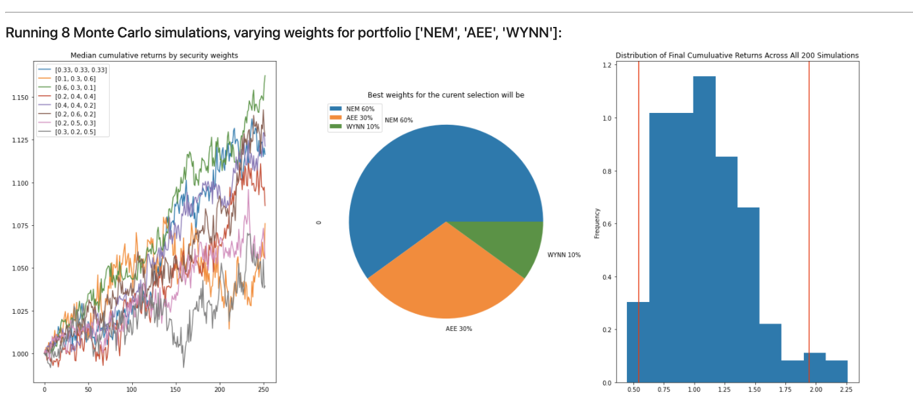

# Portfolio Advisor

This platform aims to offer financial analysis tools to be able to Automated stock screening using Modern Portfolio Theory methods to select a subset of the S&P 500. Through most of our development period, the chosen screening method yielded a list of five to seven stocks. However, under some market conditions this screening method selected only one or two stocks. Future work would include a more complex screening, including metrics that are guaranteed to select a workable list of at least three tickers.
Apply technical analysis to further reduce selected stocks to an optimal portfolio of three stocks. 
Run Monte Carlo simulations, varying weights of these three stocks to find the best outcome for the portfolio. 

---

## Technologies

This project leverages python 3.7 with the following packages:

* [tqdm](https://tqdm.github.io/) 
* [alpaca](https://www.alpacafinance.org/) 
* [MCForecast](https://pbpython.com/monte-carlo.html)
* [matplotlib](https://matplotlib.org/)
* [ipywidgets](https://ipywidgets.readthedocs.io/en/latest/index.html)
* [dotenv](https://pypi.org/project/python-dotenv/)
* [datetime](https://docs.python.org/3/library/datetime.html)
* [pathlib](https://docs.python.org/3/library/pathlib.html)
* [time](https://docs.python.org/3/library/time.html)
* [pandas](https://pandas.pydata.org/docs/index.html)
* [os](https://docs.python.org/3/library/os.html)


---

## Installation Guide

Before running the application first install the following dependencies.

```python
  pip install pandas 
  pip install alpaca-trade-api
  pip install python-dotenv
  pip install ipywidgets
```

---

## Usage

To use the Portfolio Advisor application simply open gitbash terminal and type:

```
    voila portfolio_advisor.ipynb
    
```
_Note:_ You should have a “.env” file in the same directory with the following content:

ALPACA_API_KEY = "Yout Alpaca API key" \n
ALPACA_API_SECRET_KEY = "Your Alpaca API Secret key"

Upon launching the Portfolio Advisor application you will be greeted with the following prompts.




---

[Recording of portfolio_advisor in action](https://youtu.be/hEYCvOuo3sQ)

---

## Contributors

David Jonathan

Israel Fernandez

Nara Arakelyan

---
